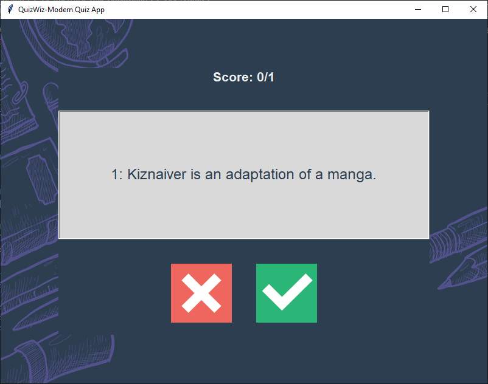

# True/False Quiz Application

A simple Python quiz application that tests your knowledge with true/false questions fetched from the Open Trivia Database.

## Features
- Dynamic quiz questions from Open Trivia Database API
- Interactive GUI with Tkinter
- Visual feedback for correct/incorrect answers
- Score tracking
- Final score display
- Auto-resizing question display

## Screenshot


## Demo
[Watch Demo Video](https://drive.google.com/file/d/1adcVWrWMfzD1qxVnRGqypwQgTkOpuFCo/view?usp=sharing)

## Project Structure
```
quiz_app/
│
├── images/
│   ├── true.png
│   └── false.png
│
├── app.py
├── data.py
├── question_model.py
├── quiz_brain.py
└── ui.py
```

## Requirements
- Python 3.x
- `requests` library

## Installation
1. Clone this repository
   ```bash
   git clone https://github.com/yourusername/quiz-app.git
   ```
2. Install required packages
   ```bash
   pip install requests
   ```

## Usage
1. Navigate to the project directory
2. Run the application:
   ```bash
   python app.py
   ```
3. Answer 10 true/false questions
4. Get your final score!

## How It Works
- Questions are fetched from the Open Trivia Database API
- User selects True/False for each question
- Correct answers turn green, incorrect turn red
- Final score is displayed after 10 questions
- Option to restart the quiz with new questions

## Contributing
Feel free to fork this project and submit pull requests for any improvements.

## License
MIT License